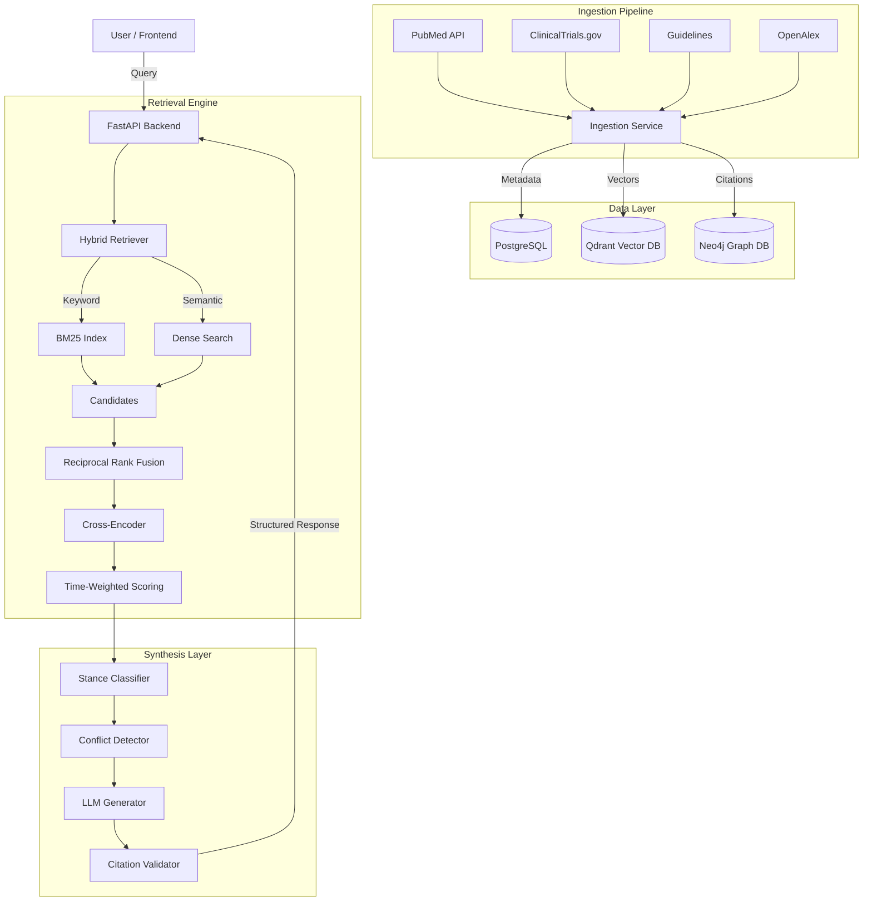

# Arthronyx Architecture

## System Overview

Arthronyx is designed as a modular, containerized application with a clear separation of concerns between data ingestion, retrieval, analysis, synthesis, and presentation.

## Core Components

### 1. Backend API (FastAPI)
- **Role**: Entry point for all interactions.
- **Key Modules**:
  - `app.api`: Route definitions.
  - `app.middleware`: Audit logging and safety checks.
  - `app.models`: Pydantic schemas for strict typing.

### 2. Hybrid Retrieval Engine
- **Strategy**: Combines sparse (BM25) and dense (bge-large-en-v1.5) retrieval.
- **Fusion**: Reciprocal Rank Fusion (RRF) (k=60).
- **Refinement**: PubMedBERT cross-encoder re-ranking.
- **Scoring**:
  $$ Score = 0.5 \times Semantic + 0.3 \times EvidenceLevel + 0.2 \times Recency $$

### 3. Analysis Modules
- **Stance Classification**: Determines if a study is Positive, Negative, Neutral, or Mixed.
- **Conflict Detection**: Aggregates stances to identify contradictions in the evidence base.
- **Citation Graph**: Uses Neo4j to track influence and detect reliance on outdated guidelines.

### 4. Synthesis Generator
- **Model**: GPT-4 (Temperature=0).
- **Constraints**:
  - Only use retrieved context.
  - Strict DOI citation requirement.
  - Mandatory 8-section output format.
- **Validation**: Post-processing step to strip hallucinated citations.

## Data Storage

| Database | Usage | Key Schemas |
|----------|-------|-------------|
| **PostgreSQL** | Structured metadata, audit logs, ingestion status. | `documents`, `audit_logs` |
| **Qdrant** | Vector embeddings of document chunks. | `arthronyx_documents` (1024-dim) |
| **Neo4j** | Citation network and influence graph. | `(:Paper)-[:CITES]->(:Paper)` |

## Security & Compliance

- **Audit Logging**: Every request/response is logged with a unique ID and processing time.
- **Safety Middleware**: Regex-based filter blocks queries resembling patient-specific advice seeking.
- **No PII**: System is designed to handle public literature data only.
